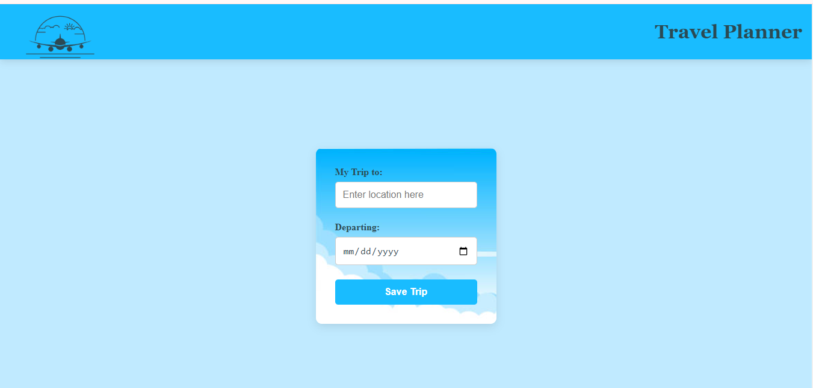
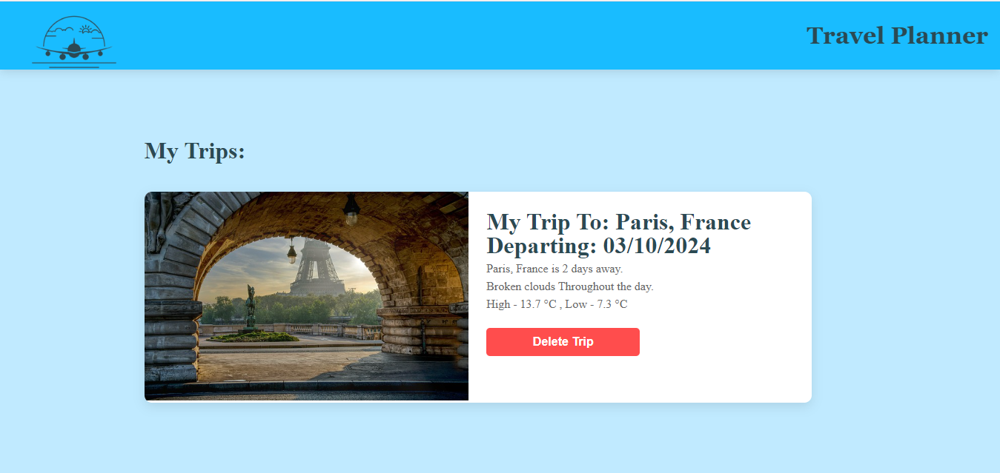

# Travel App

## Project Description

The Travel App is designed to help users plan their trips by providing real-time or predicted weather forecasts and relevant images for their chosen destination. The app leverages data from multiple APIs, allowing users to enter a location and departure date to retrieve accurate and timely travel information.

## Motivation

Travel planning can be complicated, especially when it comes to predicting weather at your destination. This project was created to simplify the process by integrating key information in one place. The motivation behind this project was to create a user-friendly application that helps travelers stay informed and make decisions based on real-time weather data.

## Screenshots

### 1. Homepage

This is an example of the app's homepage with the input fields for destination and date.



### 2. Weather Forecast

After entering a location and date, this is how the app displays the weather forecast along with an image of the destination.



## Tech/Framework Used
  - Node.js: For server-side operations.
  - Express.js: As the web framework.
  - Webpack: For bundling and optimizing the assets.
  - Sass (SCSS): For styling.
  - HTML5 & CSS3: For structuring and styling the web pages.
  - JavaScript (ES6): For functionality and interactivity.
  - APIs Used:
    - GeoNames: For fetching geographic data.
    - Weatherbit: For real-time and forecast weather data.
    - Pixabay: For fetching images related to the destination.

## Features
  - Get weather forecasts for future trips.
  - Retrieve images of the destination to give users a visual feel of the     location.
  - Store and view previously planned trips using local storage.
  - Responsive design for both desktop and mobile use.

## Installation

1. Clone the repository:
- `git clone https://github.com/RahafAbosefen/Travel-App.git`
- `cd Travel-App`

2. Install dependencies:
Ensure Node, Express, Cors, Body parser, Webpack and all required packages are installed.
- `npm install`
3. Build the project:
- Set up webpack config files for development and production environments. Download files from this repo and navigate to the project folder. Afterwards, to start the server run these commands in command line:
```
//For development:
npm run build-dev
//For production:
npm run build-prod
//Start the server:
npm run start
```
4. Open your browser and navigate to `http://localhost:8080` .

## Tests

Unit tests are written to ensure core functionalities of the app. Testing is implemented using Jest. To run tests, use the following command:
- `npm run test`

## How to Use

1. Enter the destination city or location.
2. Select the departure date.
3. Click on the Save Trip button.
4. View the weather forecast and an image of your destination displayed below the input fields.

## Project Structure

- Travel App 
  - __test__/
  - node_modules/
  - dist/
  - src/
    - client/
    - server/
  - .babelrc
  - webpack.dev.js
  - webpack.prod.js
  - .gitignore
  - service-worker
  - package-lock.json
  - package.json
  - README.md

## Credits

This project was built using starter code from Udacity. Special thanks to the developers and maintainers of the GeoNames, Weatherbit, and Pixabay APIs for making this project possible.

## Author

Code is created by  Rahaf Abo Sefen, using starter code by Udacity.