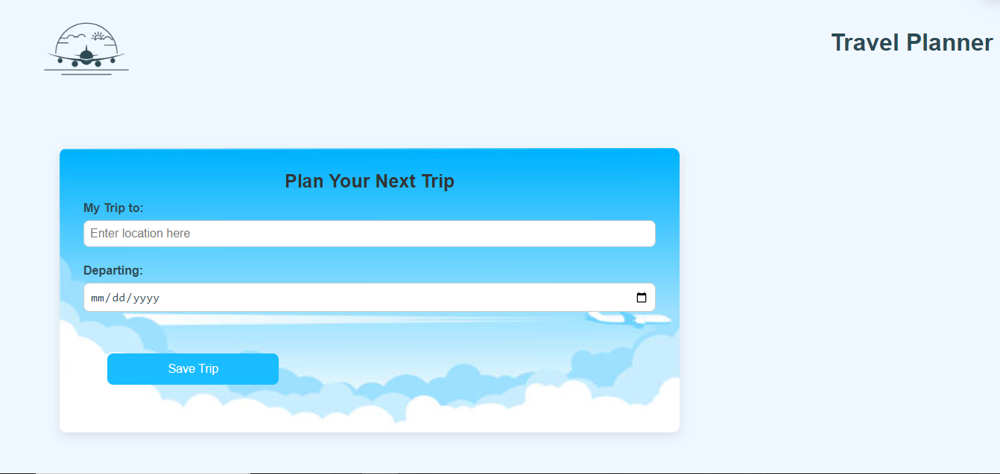
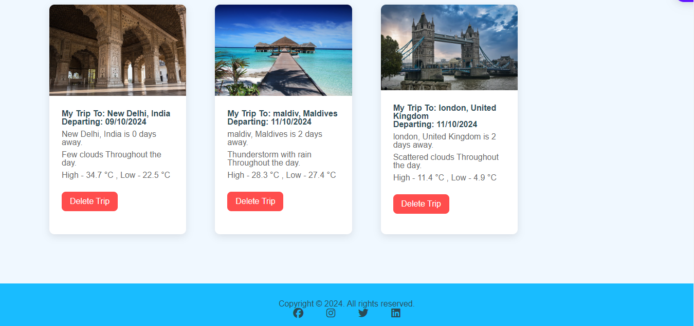

# Travel App

## Project Description
The Travel App is an innovative tool designed to simplify the trip planning process for users by providing comprehensive information about the weather and tourist attractions. The app features a simple and intuitive user interface that allows users to input their destinations and departure dates to receive accurate weather forecasts and beautiful images of the locations.

## Objectives of the App:
1. Facilitating Planning: The app aims to simplify the trip planning process by integrating essential information into one interface, helping users make informed decisions.

2. Providing Real-Time Information: The app relies on real-time data from multiple APIs to provide live updates on the weather, ensuring that users receive accurate and up-to-date information.

3. Enhanced User Experience: The app focuses on delivering a smooth and enjoyable user experience, with an easy-to-use interface and mobile compatibility, making trip planning more convenient.

4. Data Storage: It allows users to store their previous trips in local storage, making it easier for them to review past plans and replicate favorite journeys.

## Motivation
Travel planning can be complicated, especially when it comes to predicting weather at your destination. This project was created to simplify the process by integrating key information in one place. The motivation behind this project was to create a user-friendly application that helps travelers stay informed and make decisions based on real-time weather data.

## Screenshots

### 1. Homepage
This is an example of the app's homepage with the input fields for destination and date.



### 2. Weather Forecast
After entering a location and date, this is how the app displays the weather forecast along with an image of the destination.



## Tech/Framework Used
- **Node.js**: For server-side operations.
- **Express.js**: As the web framework.
- **Webpack**: For bundling and optimizing the assets.
- **Sass (SCSS)**: For styling.
- **HTML5 & CSS3**: For structuring and styling the web pages.
- **JavaScript (ES6)**: For functionality and interactivity.
- **APIs Used**:
  - **GeoNames**: For fetching geographic data.
  - **Weatherbit**: For real-time and forecast weather data.
  - **Pixabay**: For fetching images related to the destination.

## Features of the App:
  - Weather Forecasts: Provides users with accurate weather information for their chosen destinations, including daily and weekly forecasts.
  - Destination Images: Offers stunning images of the locations users can visit, helping them visualize their trip.
  - Responsive Design: The app features a design that responds to all devices, ensuring a comfortable user experience on smartphones, tablets, and desktops.
  - Intuitive User Interface: Provides an easy-to-use interface that allows users to quickly and easily enter their trip details.

## Installation
1. Clone the repository:
   ```bash
   git clone https://github.com/RahafAbosefen/Travel-App.git
   cd Travel-App
  ```
2. Install dependencies: Ensure Node.js and npm are installed. Then run:

  - `npm install`

3. Build the project: Set up webpack config files for development and production environments. To start the server, run the following commands:

```
  //For development:
  npm run build-dev
  //For production:
  npm run build-prod
  //Start the server:
  npm run start
```
4. Open your browser and navigate to `http://localhost:8080` .

## Tests

Unit tests are written to ensure core functionalities of the app. Testing is implemented using Jest. To run tests, use the following command:

  - `npm run test`

## How to Use

  1. Enter the destination city or location.
  2. Select the departure date.
  3. Click on the "Save Trip" button.
  4. View the weather forecast and an image of your destination displayed below the input fields.

## Project Structure

- Travel App 
  - __test__/
  - node_modules/
  - dist/
  - src/
    - client/
    - server/
  - .babelrc
  - webpack.dev.js
  - webpack.prod.js
  - .gitignore
  - service-worker
  - package-lock.json
  - package.json
  - README.md

## Node.js Version
  - Node.js version: v18.14.0
   
## Credits

This project was built using starter code from Udacity. Special thanks to the developers and maintainers of the GeoNames, Weatherbit, and Pixabay APIs for making this project possible.

## Author

Code created by Rahaf Abo Sefen, using starter code by Udacity. Feel free to reach out for any questions or suggestions!
